

Han Lin is a third-year Ph.D. student at the [MURGe-Lab](https://murgelab.cs.unc.edu/), [UNC at Chapel Hill](https://www.unc.edu), advised by [Prof. Mohit Bansal](https://www.cs.unc.edu/~mbansal/). He received his M.S. in Computer Science from [Columbia University](https://www.columbia.edu), where he was a member of the [DVMM Lab](https://www.ee.columbia.edu/ln/dvmm/) advised by [Prof. Shih-Fu Chang](https://www.ee.columbia.edu/~sfchang/) and the [ROAM Lab](https://roam.me.columbia.edu/) advised by [Prof. Matei Ciocarlie](https://www.me.columbia.edu/faculty/matei-ciocarlie) and [Prof. Shuran Song](https://www.cs.columbia.edu/~shurans/). He also holds an M.S. in Financial Engineering from Columbia and a B.S. in Financial Engineering from [Central University of Finance and Economics](http://en.cufe.edu.cn). He is fortunate to collaborate with [Prof. Krzysztof Choromanski](https://research.google/people/KrzysztofChoromanski/) from [Google Deepmind](https://deepmind.google), and has completed internships with the Movie Gen Team at [Meta Superintelligence Labs](https://www.meta.com), and the JEPA Team at [Meta FAIR](https://ai.meta.com/blog/meta-fair-research-new-releases/).

His research broadly lies in computer vision, multimodal learning, and theory-grounded efficient algorithms, with a focus on controllable and interactive world modeling.

- **Explicit Control via Interpretable Interfaces**: equipping visual generation with user-facing handles for controllable image/video synthesis, including [CTRL-Adapter](https://ctrl-adapter.github.io/), [VideoDirectorGPT](https://videodirectorgpt.github.io), [EPiC](https://zunwang1.github.io/Epic), [DreamRunner](https://zunwang1.github.io/DreamRunner), [DiagrammerGPT](https://diagrammergpt.github.io/), and [AnchorWeave](https://zunwang1.github.io/AnchorWeave).
- **Implicit Guidance through Stronger Priors**: enriching generative models with multimodal priors, semantic representation alignment, and dynamics-aware future-state prediction, including [Bifrost-1](https://bifrost-1.github.io/), [VEDiT](https://arxiv.org/pdf/2410.03478), [MetaCanvas](https://metacanvas.github.io/), [V-Co](https://arxiv.org/abs/2603.16792), and [SMKD](https://arxiv.org/abs/2303.15466).
- **Multimodal LLMs for Planning, Verification & Embodied Tasks**: leveraging multimodal LLMs and verifiers for embodied agent training, physics-aware video planning, 3D scene editing, including [EnvGen](https://envgen-llm.github.io/), [SketchVerify](https://sketchverify.github.io/), [VideoMSG](https://video-msg.github.io/), [DEER-3D](https://arxiv.org/pdf/2511.14086v1), and [Tandom3D](https://jxu.ai/tandem3d/).
- **Efficient & Theory-Grounded ML**: scalable Transformers, kernel methods, random features, and graph neural networks, including [HRF](https://arxiv.org/abs/2110.04367), [OMC](https://arxiv.org/abs/2005.13590), [GKAT](http://arxiv.org/abs/2107.07999), [FTFIs](https://arxiv.org/pdf/2406.15881v1), [Graph Field Integrators](https://arxiv.org/abs/2302.00942).
<!-- - **Community Benchmarks**: contributor to [Humanity's Last Exam (HLE)](https://agi.safe.ai), a *Nature* 2026 benchmark of expert-level academic questions for evaluating frontier AI capabilities. -->

Feel free to reach out to me if you would like to chat about any research ideas!

News
-----

∙ [2026-05] <a href="https://arxiv.org/pdf/2505.21876">EPiC</a> accepted to <a href="https://icml.cc">ICML 2026</a> 
∙ [2026-03] <a href="https://arxiv.org/abs/2603.16792">V-Co</a> released on arXiv 
∙ [2026-02] <a href="https://arxiv.org/abs/2602.14941">AnchorWeave</a> released on arXiv 
∙ [2026-01] We are organizing the <a href="https://any2any-mllm.github.io/workshop-cvpr26">Any-To-Any Multimodal Learning Workshop</a> at <a href="https://cvpr.thecvf.com">CVPR 2026</a> 
∙ [2026-01] <a href="https://www.nature.com/articles/s41586-025-09962-4">Humanity's Last Exam</a> published in <a href="https://www.nature.com">Nature</a> 
∙ [2025-12] <a href="https://arxiv.org/pdf/2512.11464">MetaCanvas</a> released on arXiv 
∙ [2025-11] <a href="https://arxiv.org/pdf/2511.17450">SketchVerify</a> released on arXiv 
∙ [2025-11] <a href="https://arxiv.org/pdf/2511.14086v1">Deer3D</a> released on arXiv 
∙ [2025-09] <a href="https://arxiv.org/pdf/2508.05954">Bifrost-1</a> accepted to <a href="https://neurips.cc">NeurIPS 2025</a> 
∙ [2025-05] Started research scientist internship with the <a href="https://ai.meta.com/research/movie-gen/">Media Generation Team</a> at Meta Superintelligence Labs 
∙ [2025-04] <a href="https://arxiv.org/pdf/2504.08641">Video-MSG</a> released on arXiv 
∙ [2025-01] <a href="https://arxiv.org/pdf/2410.03478">VEDiT</a> accepted to <a href="https://iclr.cc">ICLR 2025</a> 
∙ [2025-01] <a href="https://arxiv.org/abs/2404.09967">CTRL-Adapter</a> accepted to <a href="https://iclr.cc">ICLR 2025</a> as Oral (top 1.82%) 
∙ [2024-12] <a href="https://arxiv.org/pdf/2411.16657">DreamRunner</a> accepted to <a href="https://aaai.org/conference/aaai/aaai-25/">AAAI 2025</a> 
∙ [2024-09] <a href="https://arxiv.org/pdf/2406.15881v1">FTFIs</a> accepted to <a href="https://neurips.cc">NeurIPS 2024</a> 
∙ [2024-07] Three papers (<a href="https://arxiv.org/abs/2309.15091">VideoDirectorGPT</a>, <a href="https://arxiv.org/abs/2403.12014">EnvGen</a>, <a href="https://arxiv.org/abs/2310.12128">DiagrammerGPT</a>) accepted to <a href="https://colmweb.org">COLM 2024</a> 
∙ [2024-05] Started research scientist internship with the <a href="https://ai.meta.com/blog/yann-lecun-ai-model-i-jepa/">JEPA team</a> at Meta FAIR Lab 

Publications
-----

<video class="teaser-img" width="160" height="110" autoplay loop muted playsinline><source src="../videos/epic_demo_web.mp4" type="video/mp4"></video>

### EPiC: Efficient Video Camera Control Learning with Precise Anchor-Video Guidance

Zun Wang, Jaemin Cho, Jialu Li, <strong>Han Lin</strong>, Jaehong Yoon, Yue Zhang, Mohit Bansal 
<strong>ICML</strong> 2026 
<a href="https://arxiv.org/pdf/2505.21876">Paper</a> |
<a href="https://zunwang1.github.io/Epic">Project Page</a> |
<a href="https://github.com/wz0919/EPiC">Code</a>
 

-----

### A Benchmark of Expert-Level Academic Questions to Assess AI Capabilities

Center for AI Safety, Scale AI \& HLE Contributors Consortium 
<strong>Nature</strong> 2026 
<a href="https://www.nature.com/articles/s41586-025-09962-4">Paper</a> |
<a href="https://agi.safe.ai">Project Page</a>
 

-----

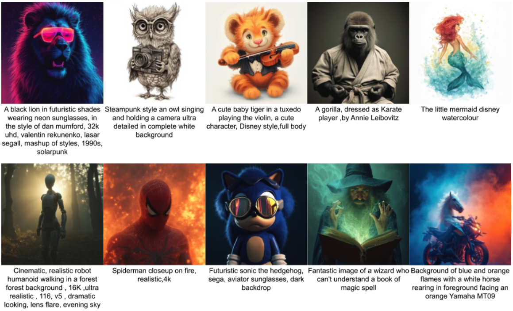

### Bifrost-1: Bridging Multimodal LLMs and Diffusion Models with Patch-level CLIP Latents

<strong>Han Lin</strong>, Jaemin Cho, Amir Zadeh, Chuan Li, Mohit Bansal 
<strong>NeurIPS</strong> 2025 
<a href="https://arxiv.org/pdf/2508.05954">Paper</a> |
<a href="https://bifrost-1.github.io/">Project Page</a> |
<a href="https://github.com/HL-hanlin/Bifrost-1">Code</a>
 

-----

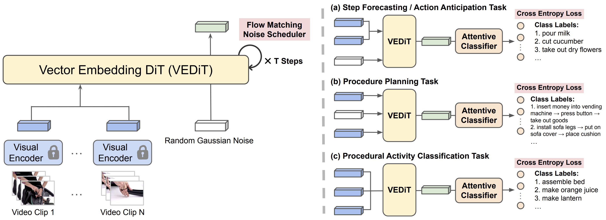

### VEDiT: Latent Prediction Architecture for Procedural Video Representation Learning

<strong>Han Lin</strong>, Tushar Nagarajan, Nicolas Ballas, Mido Assran, Mojtaba Komeili, Mohit Bansal, Koustuv Sinha 
<strong>ICLR</strong> 2025 
<a href="https://arxiv.org/pdf/2410.03478">Paper</a> |
<a href="https://slideslive.com/39035545/vedit-latent-prediction-architecture-for-procedural-video-representation-learning">Video</a>
 

-----

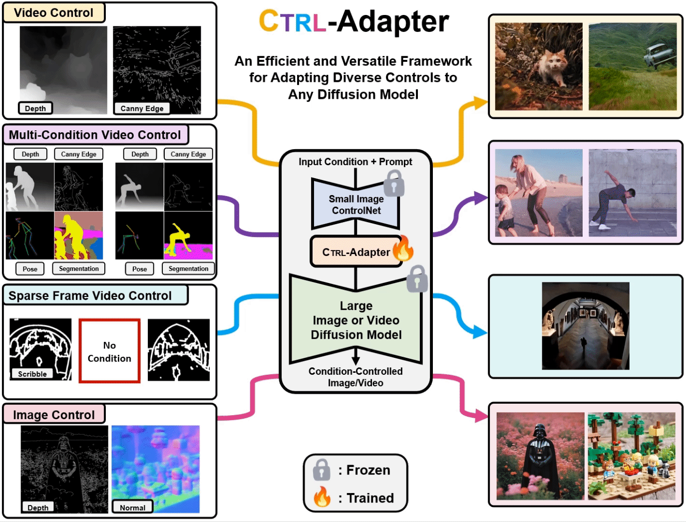

### CTRL-Adapter: An Efficient and Versatile Framework for Adapting Diverse Controls to Any Diffusion Model

<strong>Han Lin*</strong>, Jaemin Cho*, Abhay Zala, Mohit Bansal 
<strong>ICLR</strong> 2025, (Oral, Top 1.8%) 
<a href="https://arxiv.org/abs/2404.09967">Paper</a> |
<a href="https://ctrl-adapter.github.io/">Project Page</a> |
<a href="https://github.com/HL-hanlin/Ctrl-Adapter">Code</a> |
<a href="https://slideslive.com/39033741/ctrladapter-an-efficient-and-versatile-framework-for-adapting-diverse-controls-to-any-diffusion-model">Video</a> |
<a href="https://slideslive.com/39036878/ctrladapter-an-efficient-and-versatile-framework-for-adapting-diverse-controls-to-any-diffusion-model">Oral Talk</a>
 

-----

<video class="teaser-img" width="160" height="110" autoplay loop muted playsinline><source src="../videos/dreamrunner_demo_2x.mp4" type="video/mp4"></video>

### DreamRunner: Fine-Grained Storytelling Video Generation with Retrieval-Augmented Motion Adaptation

Zun Wang, Jialu Li, <strong>Han Lin</strong>, Jaehong Yoon, Mohit Bansal 
<strong>AAAI</strong> 2025 
<a href="https://arxiv.org/pdf/2411.16657">Paper</a> |
<a href="https://zunwang1.github.io/DreamRunner">Project Page</a> |
<a href="https://github.com/wz0919/DreamRunner">Code</a>
 

-----

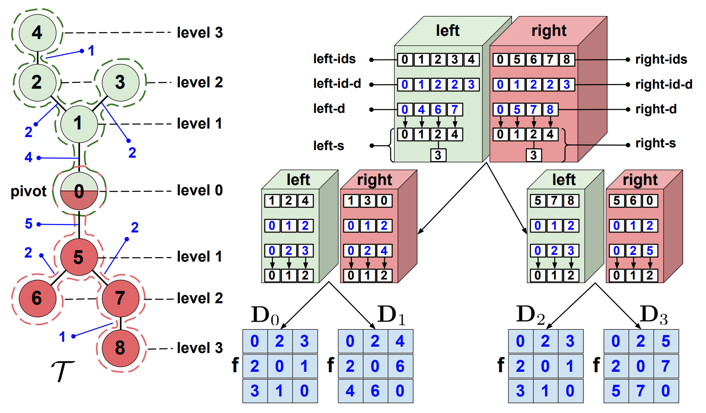

### Fast Tree-Field Integrators: From Low Displacement Rank to Topological Transformers

Krzysztof Choromanski*, Arijit Sehanobish*, Somnath Basu Roy Chowdhury*, <strong>Han Lin*</strong>, Avinava Dubey, Tamas Sarlos, Snigdha Chaturvedi 
<strong>NeurIPS</strong> 2024 
<a href="https://arxiv.org/pdf/2406.15881v1">Paper</a> |
<a href="https://slideslive.com/39024882/fast-treefield-integrators-from-low-displacement-rank-to-topological-transformers">Video</a>
 

-----

<video class="teaser-img" width="160" height="110" autoplay loop muted playsinline><source src="../videos/videodirectorgpt_teaser_4s.mp4" type="video/mp4"></video>

### VideoDirectorGPT: Consistent Multi-Scene Video Generation via LLM-Guided Planning

<strong>Han Lin</strong>, Abhay Zala, Jaemin Cho, Mohit Bansal 
<strong>COLM</strong> 2024 
<a href="https://arxiv.org/abs/2309.15091">Paper</a> |
<a href="https://videodirectorgpt.github.io">Project Page</a> |
<a href="https://github.com/HL-hanlin/VideoDirectorGPT">Code</a>
 

-----

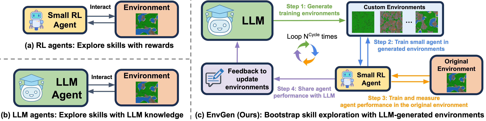

### EnvGen: Generating and Adapting Environments via LLMs for Training Embodied Agents

Abhay Zala*, Jaemin Cho*, <strong>Han Lin</strong>, Jaehong Yoon, Mohit Bansal 
<strong>COLM</strong> 2024 
<a href="https://arxiv.org/abs/2403.12014">Paper</a> |
<a href="https://envgen-llm.github.io/">Project Page</a> |
<a href="https://github.com/aszala/envgen">Code</a>
 

-----

<video class="teaser-img" width="160" height="110" autoplay loop muted playsinline><source src="../videos/diagrammergpt_demo_1to7s.mp4" type="video/mp4"></video>

### DiagrammerGPT: Generating Open-Domain, Open-Platform Diagrams via LLM Planning

Abhay Zala, <strong>Han Lin</strong>, Jaemin Cho, Mohit Bansal 
<strong>COLM</strong> 2024 
<a href="https://arxiv.org/abs/2310.12128">Paper</a> |
<a href="https://diagrammergpt.github.io/">Project Page</a> |
<a href="https://github.com/aszala/DiagrammerGPT">Code</a>
 

-----

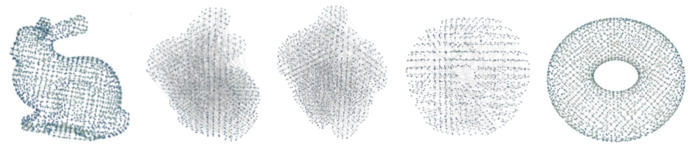

### Efficient Graph Field Integrators Meet Point Clouds

Krzysztof Choromanski*, Arijit Sehanobish*, <strong>Han Lin*</strong>, Yunfan Zhao*, Eli Berger, Alvin Pan, Tetiana Parshakova, Tianyi Zhang, David Watkins, Valerii Likhosherstov, Somnath Basu Roy Chowdhury, Avinava Dubey, Deepali Jain, Tamas Sarlos, Snigdha Chaturvedi, Adrian Weller 
<strong>ICML</strong> 2023 
<a href="https://arxiv.org/abs/2302.00942">Paper</a> |
<a href="https://github.com/topographers/efficient_graph_algorithms">Code</a> |
<a href="https://slideslive.com/39003799/efficient-graph-field-integrators-meet-point-clouds">Video</a>
 

-----

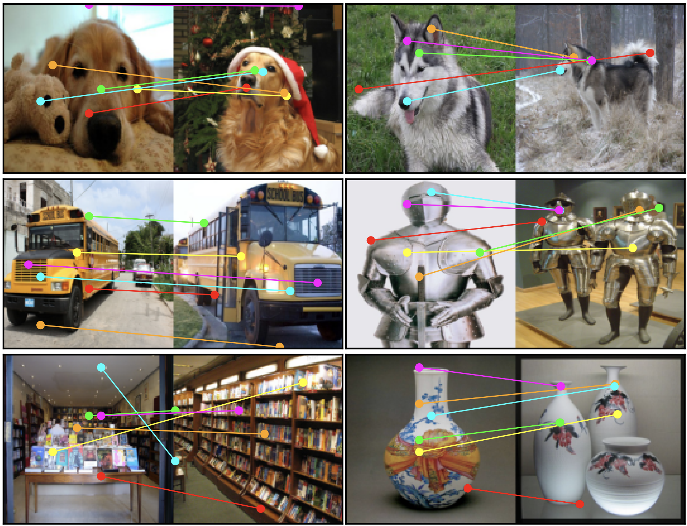

### Supervised Masked Knowledge Distillation for Few-shot Transformers

<strong>Han Lin*</strong>, Guangxing Han*, Jiawei Ma, Shiyuan Huang, Xudong Lin, Shih-Fu Chang 
<strong>CVPR</strong> 2023 
<a href="https://arxiv.org/abs/2303.15466">Paper</a> |
<a href="https://github.com/HL-hanlin/SMKD">Code</a> |
<a href="https://www.dropbox.com/s/29n9gjgzbqjqqbk/SMKD.pdf?dl=0">Slides</a>
 

-----

<video class="teaser-img" width="160" height="110" autoplay loop muted playsinline><source src="../videos/tandom3d_demo_4s.mp4" type="video/mp4"></video>

### Active Tactile Exploration for 3D Object Recognition

Jingxi Xu*, <strong>Han Lin*</strong>, Shuran Song, Matei Ciocarlie 
<strong>ICRA</strong> 2023 
<a href="https://arxiv.org/abs/2209.08772">Paper</a> |
<a href="https://jxu.ai/tandem3d/">Project Page</a> |
<a href="https://www.youtube.com/watch?v=z_90xVf1-88">Video</a>
 

-----

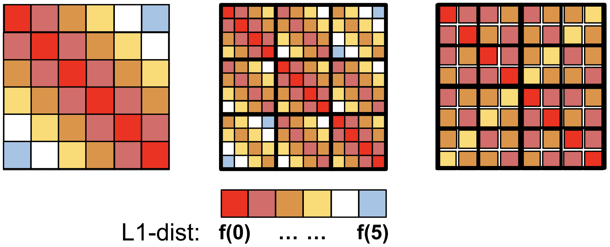

### From Block-Toeplitz Matrices to Differential Equations on Graphs: Towards a General Theory for Scalable Masked Transformers

Krzysztof Choromanski*, <strong>Han Lin*</strong>, Haoxian Chen*, Tianyi Zhang, Arijit Sehanobish, Valerii Likhosherstov, Jack Parker-Holder, Tamas Sarlos, Adrian Weller, Thomas Weingarten 
<strong>ICML</strong> 2022 
<a href="http://arxiv.org/abs/2107.07999">Paper</a> |
<a href="https://github.com/HL-hanlin/GKAT">Code</a> |
<a href="https://icml.cc/media/PosterPDFs/ICML%202022/f231f2107df69eab0a3862d50018a9b2_mzhGQSV.png">Poster</a> |
<a href="https://slideslive.com/38983809/from-blocktoeplitz-matrices-to-differential-equations-on-graphs-towards-a-general-theory-for-scalable-masked-transformers">Video</a>
 

-----

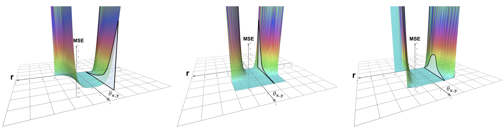

### Hybrid Random Features

Krzysztof Choromanski*, <strong>Han Lin*</strong>, Haoxian Chen*, Yuanzhe Ma*, Arijit Sehanobish*, Deepali Jain, Michael S Ryoo, Jake Varley, Andy Zeng, Valerii Likhosherstov, Dmitry Kalashnikov, Vikas Sindhwani, Adrian Weller 
<strong>ICLR</strong> 2022 
<a href="https://arxiv.org/abs/2110.04367">Paper</a> |
<a href="https://github.com/HL-hanlin/HRF_ICLR2022">Code</a> |
<a href="https://iclr.cc/virtual/2022/poster/6410">Video</a> |
<a href="https://iclr.cc/media/iclr-2022/Slides/6410.pdf">Slides</a>
 

-----

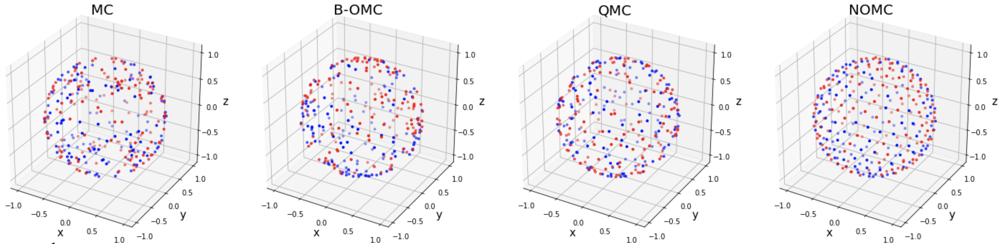

### Demystifying Orthogonal Monte Carlo and Beyond

<strong>Han Lin*</strong>, Haoxian Chen*, Tianyi Zhang, Clement Laroche, Krzysztof Choromanski 
<strong>NeurIPS</strong> 2020 
<a href="https://arxiv.org/abs/2005.13590">Paper</a> |
<a href="https://github.com/HL-hanlin/OMC">Code</a> |
<a href="https://slideslive.com/38936089/demystifying-orthogonal-monte-carlo-and-beyond">Video</a>
 

-----
### Preprints: 
-----

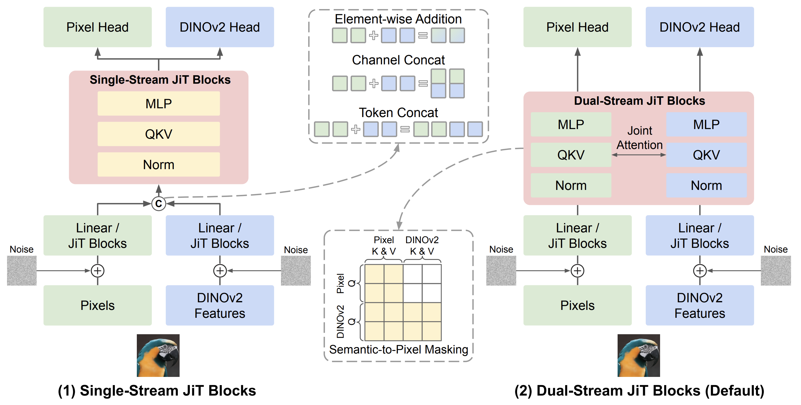

### V-Co: A Closer Look at Visual Representation Alignment via Co-Denoising

<strong>Han Lin</strong>, Xichen Pan, Zun Wang, Yue Zhang, Chu Wang, Jaemin Cho, Mohit Bansal 
arXiv Preprint, 2025 
<a href="https://arxiv.org/abs/2603.16792">Paper</a> |
<a href="https://github.com/HL-hanlin/V-Co">Code</a>
 

-----

<video class="teaser-img" width="160" height="110" autoplay loop muted playsinline><source src="../videos/metacanvas_teaser_12to41s_2x.mp4" type="video/mp4"></video>

### Exploring MLLM-Diffusion Information Transfer with MetaCanvas

<strong>Han Lin</strong>, Xichen Pan, Ziqi Huang, Ji Hou, Jialiang Wang, Weifeng Chen, Zecheng He, Felix Juefei-Xu, Junzhe Sun, Zhipeng Fan, Ali Thabet, Mohit Bansal, Chu Wang 
arXiv Preprint, 2025 
<a href="https://arxiv.org/abs/2512.11464">Paper</a> |
<a href="https://metacanvas.github.io/">Project Page</a>
 

-----

<video class="teaser-img" width="160" height="110" autoplay loop muted playsinline><source src="../videos/anchorweaver_demo_4s.mp4" type="video/mp4"></video>

### AnchorWeave: World-Consistent Video Generation with Retrieved Local Spatial Memories

Zun Wang, <strong>Han Lin</strong>, Jaehong Yoon, Jaemin Cho, Yue Zhang, Mohit Bansal 
arXiv Preprint, 2025 
<a href="https://arxiv.org/abs/2602.14941">Paper</a> |
<a href="https://zunwang1.github.io/AnchorWeave">Project Page</a> |
<a href="https://github.com/wz0919/AnchorWeave">Code</a>
 

-----

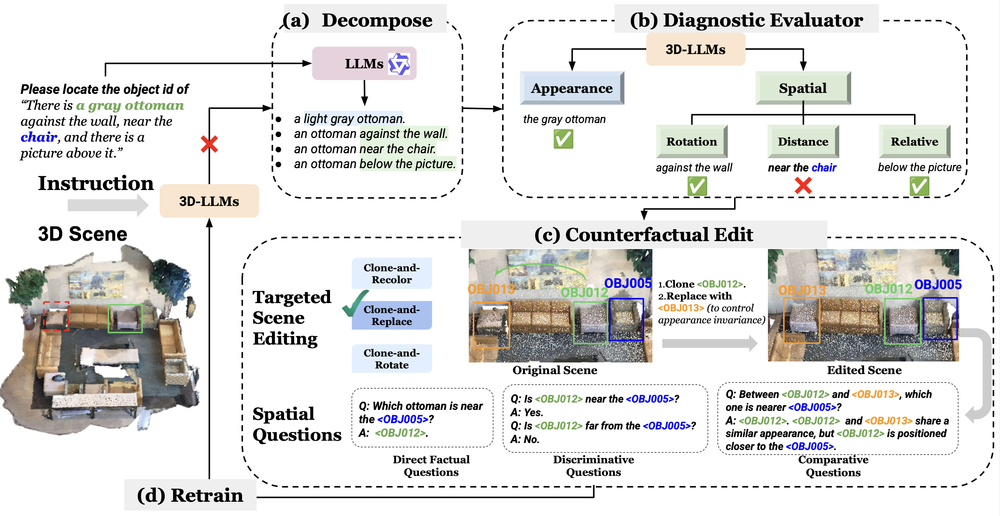

### Error-Driven Scene Editing for 3D Grounding in Large Language Models

Yue Zhang, Zun Wang, <strong>Han Lin</strong>, Jialu Li, Jianing Yang, Yonatan Bitton, Idan Szpektor, Mohit Bansal 
arXiv Preprint, 2025 
<a href="https://arxiv.org/pdf/2511.14086v1">Paper</a> |
<a href="https://github.com/zhangyuejoslin/Deer-3D">Code</a>
 

-----

### Planning with Sketch-Guided Verification for Physics-Aware Video Generation

Yidong Huang, Zun Wang, <strong>Han Lin</strong>, Dong-Ki Kim, Shayegan Omidshafiei, Jaehong Yoon, Yue Zhang, Mohit Bansal 
arXiv Preprint, 2025 
<a href="https://arxiv.org/pdf/2511.17450">Paper</a> |
<a href="https://sketchverify.github.io/">Project Page</a> |
<a href="https://github.com/h6kplus/SketchVerify">Code</a>
 

-----

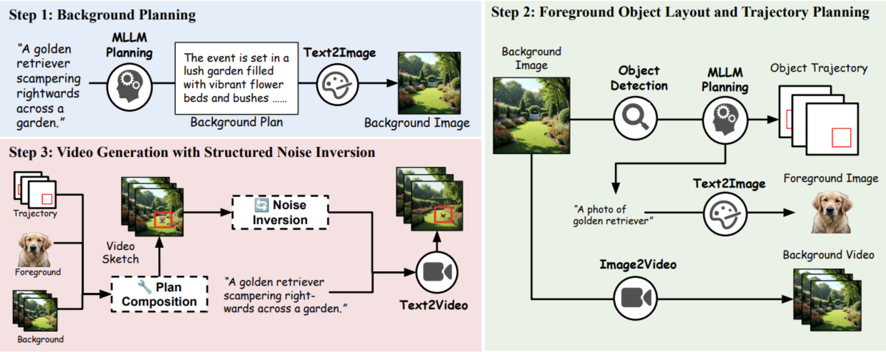

### Training-Free Guidance in Text-to-Video Generation via Multimodal Planning and Structured Noise Initialization

Jialu Li*, Shoubin Yu*, <strong>Han Lin*</strong>, Jaemin Cho, Jaehong Yoon, Mohit Bansal 
arXiv Preprint, 2025 
<a href="https://arxiv.org/pdf/2504.08641">Paper</a> |
<a href="https://video-msg.github.io/">Project Page</a> |
<a href="https://github.com/jialuli-luka/Video-MSG">Code</a>
 

-----

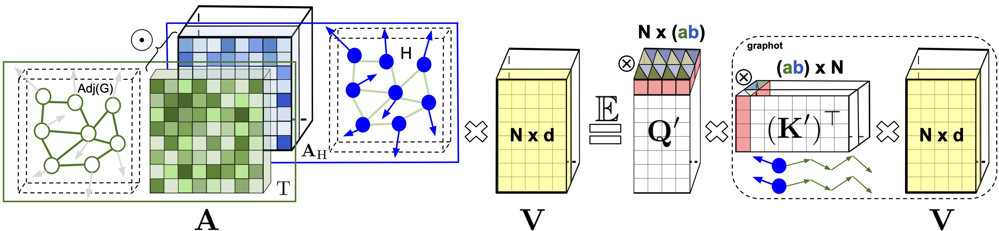

### Graph Kernel Attention Transformers

Krzysztof Choromanski*, <strong>Han Lin*</strong>, Haoxian Chen*, Jack Parker-Holder 
arXiv Preprint, 2021 
<a href="https://github.com/HL-hanlin/GKAT/blob/main/GKAT_16Jul2021.pdf">Paper</a> |
<a href="https://github.com/HL-hanlin/GKAT">Code</a>
 

* Equal contribution.

Education
-----

### University of North Carolina at Chapel Hill

Aug 2023 - Exp. May 2028 
Ph.D. in Computer Science 
<a href="https://murgelab.cs.unc.edu/">MURGe-Lab</a>, advised by <a href="https://www.cs.unc.edu/~mbansal/">Prof. Mohit Bansal</a>

-----

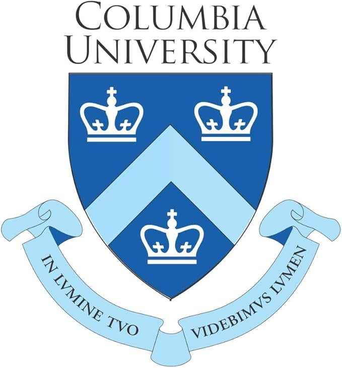

### Columbia University

2021 - 2023 
M.S. in Computer Science (Machine Learning Track) 
<a href="https://www.ee.columbia.edu/ln/dvmm/">DVMM Lab</a>, advised by <a href="https://www.ee.columbia.edu/~sfchang/">Prof. Shih-Fu Chang</a> 
<a href="https://roam.me.columbia.edu/">ROAM Lab</a>, advised by <a href="https://www.me.columbia.edu/faculty/matei-ciocarlie">Prof. Matei Ciocarlie</a> and <a href="https://www.cs.columbia.edu/~shurans/">Prof. Shuran Song</a>

-----

### Columbia University

2018 - 2020 
M.S. in Financial Engineering

-----

### Central University of Finance and Economics

2014 - 2018 
B.S. in Financial Engineering

Experience
-----
2025.5 - 2026.5: Research Scientist Intern, <a href="https://ai.meta.com/research/movie-gen/">Movie Gen Team</a>, Meta Superintelligence Lab 
2024.5 - 2024.12: Research Scientist Intern, <a href="https://ai.meta.com/blog/yann-lecun-ai-model-i-jepa/">JEPA Team</a>, Meta FAIR Lab 
2023 - Present: Research Assistant, <a href="https://murgelab.cs.unc.edu/">MURGe-Lab</a>, UNC-Chapel Hill (with Prof. Mohit Bansal) 
2021 - 2022: Research Assistant, <a href="https://www.ee.columbia.edu/ln/dvmm/">DVMM Lab</a>, Columbia University (with Prof. Shih-Fu Chang) 
2021 - 2022: Research Assistant, <a href="https://roam.me.columbia.edu/">ROAM Lab</a>, Columbia University (with Prof. Matei Ciocarlie and Prof. Shuran Song) 
2019 - 2024: Research Collaboration with Prof. <a href="https://research.google/people/KrzysztofChoromanski/">Krzysztof Choromanski</a> (Google Deepmind) 

Professional Service
-----
### Reviewer: 
NeurIPS 2022-2026, ICML 2022-2026, ICLR 2024-2025, CVPR 2025-2026, ICCV 2025, ECCV 2026 
### Workshop Organizer: 
[CVPR Workshop On Any-to-Any Multimodal Learning](https://any2any-mllm.github.io/workshop-cvpr26/), 2026
### Conference Volunteer: 
[Robotics: Science and Systems (RSS)](https://roboticsconference.org/2022/), 2022

Teaching Assistant
-----
[COMS 4231 Analysis of Algorithms](http://www.cs.columbia.edu/~mihalis/cs4231/syllabus.html), Columbia University, 2022 Fall 
[COMS 4732 Computer Vision 2: Learning](https://drive.google.com/drive/folders/1WBraYFj2umBYm4yf057BqIJKtwP5KAP5), Columbia University, 2022 Spring 
[COMS 4721 Machine Learning for Data Science](https://www.cs.columbia.edu/~djhsu/coms4771-f20/), Columbia University, 2022 Spring 
[QMSS 5073 Machine Learning for Social Science](https://www.coursicle.com/columbia/courses/QMSS/G5073/), Columbia University, 2021 Fall 
[IEOR 4007 Optimization Models & Methods for FE](https://www.coursicle.com/columbia/courses/IEOR/E4007/), Columbia University, 2019 Fall 
[IEOR 4418 Transportation Analytics & Logistics](https://www.coursicle.com/columbia/courses/IEOR/E4418/), Columbia University, 2019 Spring
